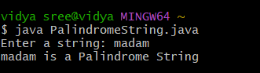

# java-lab-cse-g-5ef-add3
additional experiment -3
## ADDITIONAL EXPERIMENT -3 
source code 
java 
```
import java.util.Scanner;

class PalindromeString {
    public static void main(String[] args) {
        String str, reverse = "";

        Scanner sc = new Scanner(System.in);
        System.out.print("Enter a string: ");
        str = sc.nextLine();

        for (int i = str.length() - 1; i >= 0; i--) {
            reverse = reverse + str.charAt(i);
        }
3
        if (str.equals(reverse)) {
            System.out.println(str + " is a Palindrome String");
        } else {
            System.out.println(str + " is NOT a Palindrome String");
        }
    }
}


```
# OUTPUT: 
 
